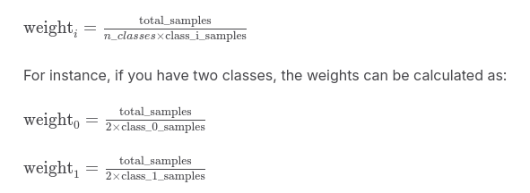

# compute-class-weights
**Problem: Class Imbalance**
- In many object detection datasets, some object classes appear much more frequently than others.
- For example, you might have thousands of images with "car" objects but only a few dozen with "pedestrian" objects.
- This imbalance can lead to:
  - The model becoming biased towards the dominant classes.
  - Poor performance on the minority classes.
  - The model might simply learn to ignore the minority classes because they have little impact on the overall loss.

**Solution: Class Weights**
- Class weights are used to give more importance to the minority classes during training.
- The code calculates weights that are inversely proportional to the frequency of each class.
- This means:
  - Classes that appear less frequently will have higher weights.
  - Classes that appear more frequently will have lower weights.
- These weights are then incorporated into the loss function used during training.
- By doing so, the model is penalized more heavily for errors on the minority classes, forcing it to learn them better.

